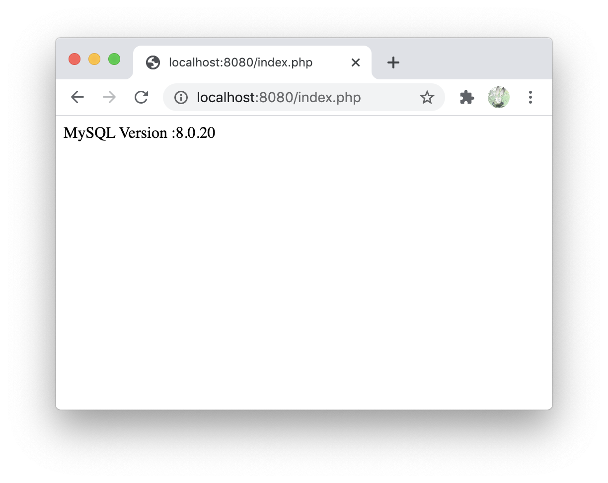

docker-composeで、nginx、php、mysqlの環境を作成してみた

# Usage

```shell
git clone git@github.com:okumurakengo/docker-nginx-php-mysql.git
cd docker-nginx-php-mysql
docker-compose up -d
```



```shell
docker-compose stop
```
